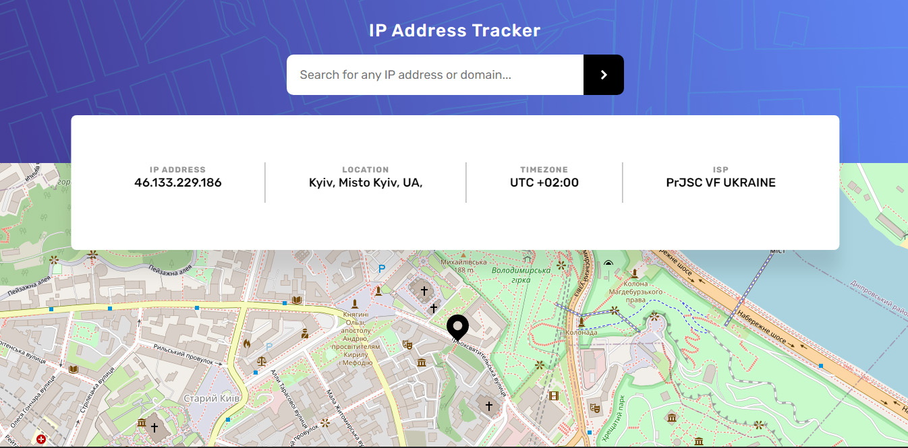

# IP address tracker application

This is a solution to the [IP address tracker challenge on Frontend Mentor](https://www.frontendmentor.io/challenges/ip-address-tracker-I8-0yYAH0). Frontend Mentor challenges help you improve your coding skills by building realistic projects. 

## Table of contents

- [Overview](#overview)
  - [The challenge](#the-challenge)
  - [Screenshot](#screenshot)
  - [Links](#links)
- [My process](#my-process)
  - [Built with](#built-with)
  - [What I learned](#what-i-learned)
  - [Continued development](#continued-development)
  - [Useful resources](#useful-resources)

## Overview

### The challenge

Users should be able to:

- View the optimal layout for each page depending on their device's screen size
- See hover states for all interactive elements on the page
- See their own IP address on the map on the initial page load
- Search for any IP addresses or domains and see the key information and location

### Screenshot

### Links

- Live Site URL: [live site URL](https://olehtovkaniuk.github.io/ip-tracker-fm/)

## My process

### Built with

- CSS
- Flexbox
- Mobile-first workflow
- [React](https://reactjs.org/) - A JavaScript library for building user interfaces
- [Ipify](https://www.ipify.org/) - API for IP Geolocation
- [Leaflet.js](https://leafletjs.com/) - JavaScript library for interactive maps

### What I learned

✔ I learned about enviroment variables and made one to store Ipify API key.

✔ I have recalled basic knowledge of dynamic data flow in React - from top component state to lower components throgh props.

✔ I ran into a problem with Adblocker that is blocking Ipify API bcz Ipify is included in Adblocker's EasyPrivacy Filter List. 
Perfect decision would be to write some serverless logic which would receive client's request and redirect it to the real API. 
But it requires deep dive into serverless architecture and I want to focus on React now, that's why I decided don't follow up this issue. 

### Continued development
In the next projects I'm planning to practice:

✔ dive deeper in practice of React: state management, Synthetic Events amd Forms, Async React;

✔ recall testing of React app using Jest;

✔ add Redux and React Router to a project;

✔ use [Thinking in React](https://reactjs.org/docs/thinking-in-react.html) guide for building my next project;

### Useful resources

- [Article by Chris Love](https://love2dev.com/blog/what-the-heck-does-neterr_blocked_by_client-mean-and-how-can-you-fix-it/) - This helped me for better understanding of Adblocker issue.
- [Leaflet - Build React.js Map App by Vicode Media](https://www.youtube.com/watch?v=PMtXhxW6t2k&t=1173s) - This video helped me to set up Leaflet.js maps.
